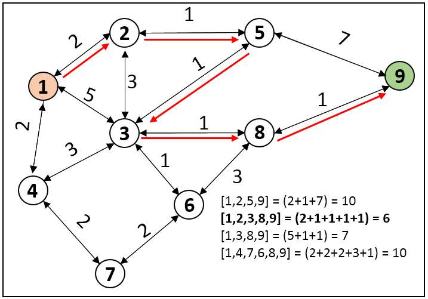

# Dijkstra's Algorithm for Romania Roadmap

## Define Dijkstra's Algorithm

Dijkstra's Algorithm finds the shortest path in terms of total edge weights in a weighted graph with non-negative edge weights. It uses a priority queue (min-heap) to prioritize nodes with the smallest known distance.

## Define the Problem of Romania Roadmap

The problem involves finding the shortest path from a starting city to a destination city in Romania using a given roadmap represented as a weighted graph.

## Explain The Algorithm Steps

### Initialization

- Initialize a priority queue (`frontier`) with the start node and its distance set to 0.
- Initialize a dictionary (`came_from`) to track the path from each node back to its predecessor.
- Initialize a dictionary (`cost_so_far`) to keep track of the shortest known distance to each node.

### Dijkstra's Algorithm Execution

- While the priority queue `frontier` is not empty:
  - Dequeue the node with the smallest known distance (`current`) from the priority queue.
  - If `current` is the goal node, reconstruct the shortest path using `came_from` and return it.
  - Otherwise, iterate through each neighbor of `current`:
    - Calculate the new cost to reach the neighbor via `current`.
    - If the new cost is less than the current known cost to the neighbor, update the cost and enqueue the neighbor with the updated priority.
    - Record `current` as the predecessor of the neighbor (`came_from`).

### Path Reconstruction

- If the goal node is found, reconstruct the shortest path from start to goal using the `came_from` dictionary.

## Explain Code Structure

### Graph Representation

The roadmap (graph) is represented as a dictionary (`graph`) where keys are cities (nodes) and values are dictionaries of neighboring cities with associated edge weights.

### `dijkstra_search` Function

- **Input Parameters:**
  - `graph`: The graph represented as an adjacency list with weighted edges.
  - `start`: The starting city.
  - `goal`: The destination city.
- **Output:**
  - Returns the shortest path (list of cities) from `start` to `goal` if one exists, otherwise returns `None`.

## How to Run the Code

### Prerequisites

- Ensure you have Python installed on your computer. If not, download and install Python from the [official website](https://www.python.org/).

### Steps to Run the Code

1. **Download the Code:**
   - Download the Python script containing the `dijkstra_search` function and the graph representation (roadmap). Save it to your computer.

2. **Open a Text Editor:**
   - Use any text editor (e.g., Notepad, VS Code, Sublime Text) to open the downloaded Python script.

3. **Edit Start and Goal Cities:**
   - Locate the part of the script where the start and goal cities are defined.
   - Modify the `start` and `goal` variables to specify your desired starting and destination cities within the Romania roadmap.

4. **Run the Script:**
   - Execute the Python script using a terminal or command prompt: `python script_name.py`.

## Conclusion

This Dijkstra's Algorithm implementation provides a method to find the shortest path between cities in the Romania roadmap (graph) using edge weights. Dijkstra's Algorithm is suitable for graphs with non-negative edge weights and guarantees finding the shortest path. The provided code demonstrates how to apply Dijkstra's Algorithm to solve pathfinding problems efficiently in a graph-based context.

